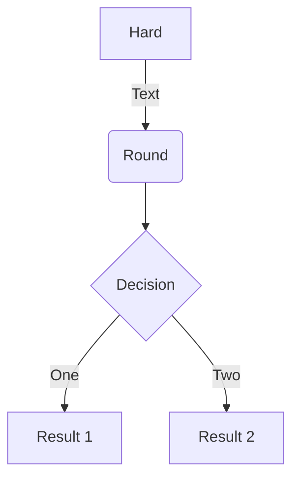

# TurboModules: The Evolution of Native Integration

**TurboModules** represents the next generation of Native Modules in React Native. They leverage the JSI (JavaScript Interface) to allow for lazy loading, strictly typed interfaces, and direct C++ communication.

## 1. The Core Problem: Eager Initialization

In the legacy architecture, **Native Modules** were "eagerly" initialized.
- When the app starts, React Native had to initialize *every single registered native module* (Bluetooth, Camera, Location, Storage, etc.), even if the user didn't need them yet.
- This massively impacted **TTI (Time to Interactive)** and increased startup memory usage.

---

## 2. The Solution: Lazy Loading via JSI

TurboModules are "lazy." They are effectively C++ Host Objects held by the JSI Runtime. They are instantiated only when your JavaScript code actually calls them.

### Initialization Flowchart

```mermaid
sequenceDiagram
    participant App
    participant JS as JS Thread
    participant Legacy as Legacy Module
    participant Turbo as TurboModule

    Note over App: App Launch 🚀

    rect rgb(40, 40, 40)
    Note over Legacy: Legacy Behavior (Blocking)
    App->>Legacy: Initialize Camera? (Yes)
    App->>Legacy: Initialize Bluetooth? (Yes)
    App->>Legacy: Initialize FileSystem? (Yes)
    Legacy-->>App: All Ready (Slow Start)
    end

    rect rgb(0, 50, 0)
    Note over Turbo: TurboModule Behavior (Instant)
    App-->>JS: App Ready (Fast!)
    Note over JS: User presses "Scan"
    JS->>Turbo: require('Camera')
    Turbo-->>JS: Initialize Camera (Just-in-Time)
    end
```





---

## 3. Codegen & Type Safety

Legacy modules relied on "best effort" communication. If you sent a string to a method expecting a number, the app would crash silently or throw a runtime error.

TurboModules enforce **Static Type Safety** across the JS/Native boundary using **Codegen**.
1.  You define the interface in TypeScript/Flow.
2.  **Codegen** generates C++, Obj-C, and Java scaffolding during the build.
3.  If the native implementation doesn't match the JS spec, the build fails.

### Spec Example (TypeScript)

```typescript
import type { TurboModule } from 'react-native';
import { TurboModuleRegistry } from 'react-native';

export interface Spec extends TurboModule {
  // Synchronous method execution via JSI!
  multiply(a: number, b: number): number;
  
  // Standard Asynchronous method
  captureImage(quality: number): Promise<string>;
}

export default TurboModuleRegistry.getEnforcing<Spec>('CameraModule');
```

---

## 4. Production Impact

Adopting TurboModules directly correlates to business metrics:
* **Startup Time**: Drastically reduced (linear reduction based on number of modules).
* **Memory Footprint**: Lower peak memory usage during initialization.
* **Stability**: Type mismatches are caught at compile time, not in production crash logs.
`